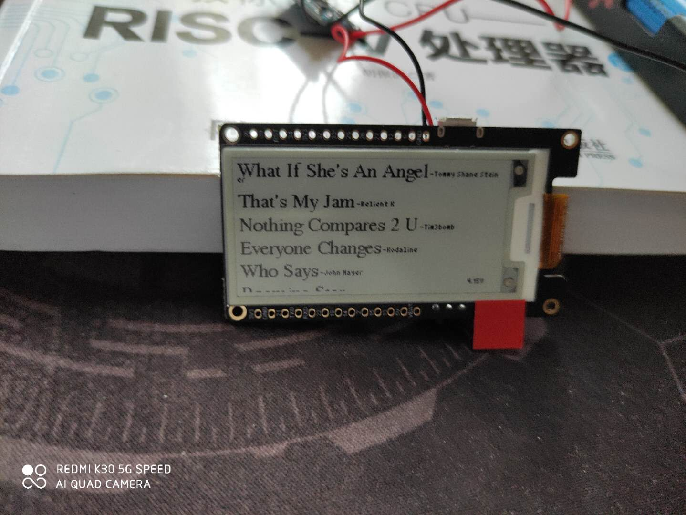

# 163Music-Feed-Viewer

Runs on LilyGo T5 V2.3 2.13 inch EPD dev board.

Developed using PlatformIO.

Before compiling the project, create a `definitions.h` file under `./src` which defines `WIFI_SSID`, `WIFI_PASSWORD` and `NEUID`:beer::beer::beer:

The information on the EPD is updated once every 10 minutes. The battery voltage is shown on the bottom right corner.