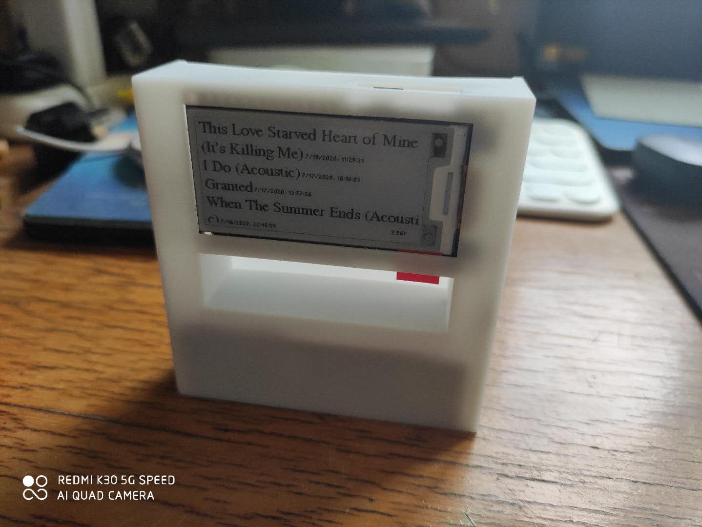

# 163Music-Feed-Viewer



Runs on LilyGo T5 V2.3 2.13 inch EPD dev board.

Developed using PlatformIO IDE.

The information on the EPD is updated once every 10 minutes. The battery voltage is shown on the bottom right corner.

## Setup

- Install VSCode and PlatformIO extension
- Clone this repo
- Create a `definitions.h` file under `./src` which defines `WIFI_SSID`, `WIFI_PASSWORD` and `NEUID` (see example below)
- Done :beer::beer::beer:

Example of `definitions.h`:

```C
// src/definitions.h
#define WIFI_SSID wireless@163
#define WIFI_PASSWORD password@163
#define NEUID 32953014
```
